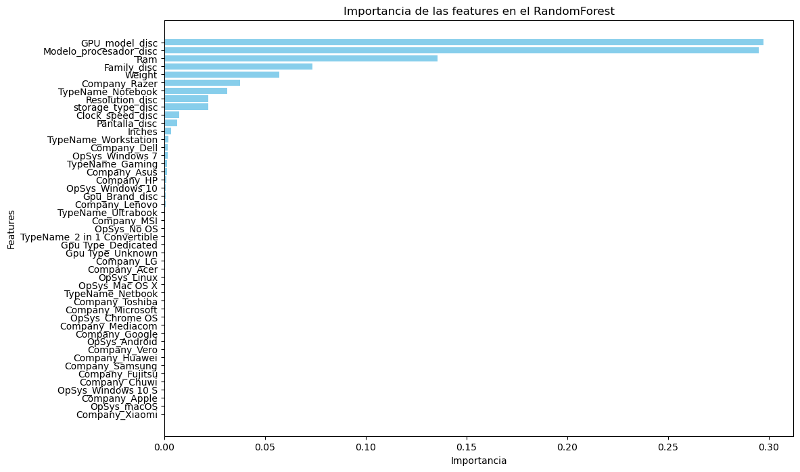
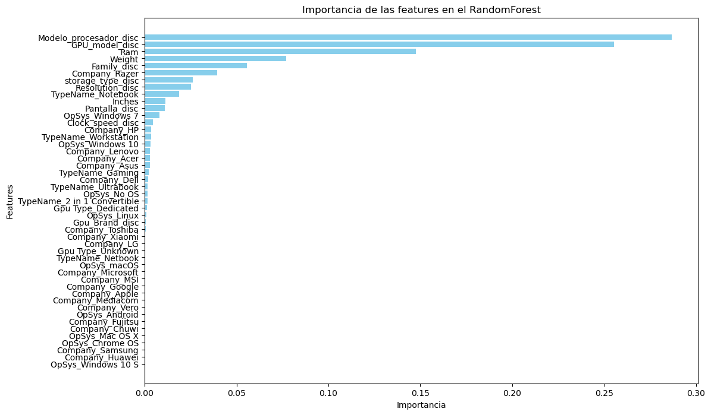

# EDA
Tras la experiencia fallida de haber entrenado varios modelos en los que se han tenido en cuenta todas las columnas categóricas:
['Company',
 'TypeName',
 'ScreenResolution',
 'Cpu',
 'Memory',
 'Gpu',
 'OpSys',
 'Resolution',
 'Pantalla',
 'Brand',
 'Family',
 'Model',
 'Gpu Brand',
 'Gpu Model',
 'Gpu Type',
 'Storage Type',
 'Price_disc']

Luego se han tenido problemas para hacer la comparación con test_set dado que en el train_set había columnas que no había en el test_set y daba error.
No me queda más remedio que seleccionar.  
Inicialmente tomaré las siguientes columnas:
['Company',
 'TypeName',
'OpSys',
  'Pantalla',
 'Brand',
 'Family',
 'Gpu Brand',
 'Gpu_Model_disc',
 'Gpu Type',
 'Storage Type',
 'CPU_Model_disc']

 Y si utilizao k-means o dbscan para clusterizar las variables categóricas en vez de hacer uns discretización aleatoria...
 


# Análisis
## Visual y estadístico
### Análisis bivariable target (price_disc) con las categóricas
Las features correlacionadas son: ['Company', 'TypeName', 'ScreenResolution', 'Cpu', 'Memory', 'Gpu', 'OpSys', 'Resolution', 'Pantalla', 'Brand', 'Family', 'Model', 'CPU_Model_disc', 'Gpu Brand', 'Gpu Model', 'Gpu Type', 'GPU_Model_disc', 'Storage Type']
### Análisis bivariable target (Price_euros) con las numéricas
Variables significativas para el modelo: ['Ram', 'Weight', 'Clock Speed (GHz)']

Quitando aquellas que pueden dificultar el análisis por el one_hot_encoding:

features_selec_visual = ['Company', 'TypeName', 'OpSys', 'Resolution', 'Pantalla', 'Brand', 'Family', 'CPU_Model_disc', 'Gpu Brand', 'Gpu Type', 'GPU_Model_disc', 'Storage Type','Ram', 'Weight', 'Clock Speed (GHz)']


### Resultado entrenamiento variables visual
Con todas las varaibles no descartadas:
* modelo: LinearRegression: -163.01
* modelo: RandomForestregression: -153.53
* modelo: XGBoostRegressor: -153.94
* modelo: KNN: -125.99

Best Parameters for Regression: {'algorithm': 'kd_tree', 'n_neighbors': 3, 'weights': 'distance'}
Best Score for Regression: -118.2735129801088

Al hacer el predict:  
MAE selección visual: 13.852474415204679

Demasiado ajustado, hay overfitting!!!!????

# Modelos
Instanciación de base
```python
lin_reg = LinearRegression()
rf_model = RandomForestRegressor(max_depth=5, random_state=42)
xgb = XGBRFRegressor(max_depth = 5, random_state = 42)
knn = KNeighborsRegressor(n_neighbors=5)
```

# Comparación de modelos con cross_val_score tras feature selection:
- Selección mediante ANOVA y SelectkBest
- Selección mediante SelectFromModel
- Selección usando RFE
- Selección por SFS

De primeras he puesto 15 features a seleccionar en losm odelos donde se peude elegir.  
Me ha dado mejor resultado el SelectFromModel. Como es la única lista que tiene más cantidad de features, voy a ver si incrementando el número de features del resto mejoran sus resultados:

Resultados con 15 features en todos los modelos excepto SelectFromModel:

Lista: ANNOVA y modelo: LinearRegression: -188.74  
Lista: ANNOVA y modelo: RandomForestregression: -169.74  
Lista: ANNOVA y modelo: XGBoostRegressor: -164.23  
Lista: ANNOVA y modelo: KNN: -159.17  

Lista: SelectFromModel y modelo: LinearRegression: -158.58  
Lista: SelectFromModel y modelo: RandomForestregression: -152.63  
Lista: SelectFromModel y modelo: XGBoostRegressor: -153.81  
Lista: SelectFromModel y modelo: KNN: -143.7  

Lista: RFE y modelo: LinearRegression: -175.91  
Lista: RFE y modelo: RandomForestregression: -153.03  
Lista: RFE y modelo: XGBoostRegressor: -148.46  
Lista: RFE y modelo: KNN: -154.3  

Lista: SFS y modelo: LinearRegression: -218.44  
Lista: SFS y modelo: RandomForestregression: -153.77  
Lista: SFS y modelo: XGBoostRegressor: -151.39  
Lista: SFS y modelo: KNN: -163.84  

Incrementando el número de features a 30 del resto, dejando SelectFromModel igual, a ver si hay mejora:

Lista: Visual y modelo: LinearRegression: -163.01  
Lista: Visual y modelo: RandomForestregression: -153.53  
Lista: Visual y modelo: XGBoostRegressor: -153.94  
Lista: Visual y modelo: KNN: -125.99  

Lista: ANNOVA y modelo: LinearRegression: -188.74  
Lista: ANNOVA y modelo: RandomForestregression: -169.74  
Lista: ANNOVA y modelo: XGBoostRegressor: -164.23  
Lista: ANNOVA y modelo: KNN: -159.17  

Lista: SelectFromModel y modelo: LinearRegression: -158.58  
Lista: SelectFromModel y modelo: RandomForestregression: -152.63  
Lista: SelectFromModel y modelo: XGBoostRegressor: -153.81  
Lista: SelectFromModel y modelo: KNN: -143.7  

Lista: RFE y modelo: LinearRegression: -167.88  
Lista: RFE y modelo: RandomForestregression: -152.15  
Lista: RFE y modelo: XGBoostRegressor: -152.31  
Lista: RFE y modelo: KNN: -140.32  

Lista: SFS y modelo: LinearRegression: -222.86  
Lista: SFS y modelo: RandomForestregression: -152.31  
Lista: SFS y modelo: XGBoostRegressor: -153.24  
Lista: SFS y modelo: KNN: -160.6  

Sí parece que hay cierta mejora introduciendo más features, pero por lo que veo el mejor modelo es el que se ha tomoado como línea base siendo KNN el que mejor resultado ha obtenido.

No obstante, hago la optimización de hiperparámetros del RandomForest que ha sido el segudo mejor modelo con la lista de features de RFE.

```python
X_train_model = df_engin[features_rfe]

param_grid = {
    'n_estimators': [100, 200, 300],
    'criterion': ['absolute_error'],
    'max_depth': [None, 10, 20, 30],
    'min_samples_split': [2, 10, 20],
    'min_samples_leaf': [1, 5, 10],
    'max_features': ['auto', 'sqrt', 'log2'],
    'bootstrap': [True, False]
}

rf_model_grid = GridSearchCV(estimator=rf_model,
							   param_grid=param_grid,
							   scoring='neg_median_absolute_error',
							   cv=5,
							   n_jobs=-1)

rf_model_grid.fit(X_train_model, y_train_engin)

```

Best Parameters for Classification: {'bootstrap': False, 'criterion': 'absolute_error', 'max_depth': None, 'max_features': 'log2', 'min_samples_leaf': 1, 'min_samples_split': 2, 'n_estimators': 200}
Best Score for Classification: -107.05955249999988

Menuda sorpresa!!!! Da mejor que el KNN!!! incluso optimizado


KNN optimizado

```python
param_grid_knn_reg = {
    'n_neighbors': [3, 5, 7, 9, 11],
    'weights': ['uniform', 'distance'],
    'algorithm': ['auto', 'ball_tree', 'kd_tree', 'brute']
}

# Instanciar el modelo KNN para regresión
knn_hip = KNeighborsRegressor()

# Realizar la búsqueda de hiperparámetros
knn_hip_grid = GridSearchCV(estimator=knn_reg,
                                param_grid=param_grid_knn_reg,
                                scoring='neg_median_absolute_error',
                                cv=5,
                                n_jobs=-1)

knn_hip_grid.fit(X_train_model, y_train_engin)

```

Como era de esperar, lo mismo de antes:

Best Parameters for Regression: {'algorithm': 'kd_tree', 'n_neighbors': 3, 'weights': 'distance'}
Best Score for Regression: -118.2735129801088


Al pasar el test resulta que hay columnas en X_train que no están en X_test y viceversa, por lo que no puedo hacer el predict.
He igualado las columnas con valores 0

He vuelto a realizar la selección de features y entrenar los modelos. El resultatado es:

Lista: Visual y modelo: LinearRegression: -159.72  
Lista: Visual y modelo: RandomForestregression: -151.13  
Lista: Visual y modelo: XGBoostRegressor: -154.48  
Lista: Visual y modelo: KNN: -126.48  

Lista: ANNOVA y modelo: LinearRegression: -171.91  
Lista: ANNOVA y modelo: RandomForestregression: -162.05  
Lista: ANNOVA y modelo: XGBoostRegressor: -156.6  
Lista: ANNOVA y modelo: KNN: -140.34  

Lista: SelectFromModel y modelo: LinearRegression: -161.04  
Lista: SelectFromModel y modelo: RandomForestregression: -152.54  
Lista: SelectFromModel y modelo: XGBoostRegressor: -152.25  
Lista: SelectFromModel y modelo: KNN: -143.47  

Lista: RFE y modelo: LinearRegression: -165.1  
Lista: RFE y modelo: RandomForestregression: -151.59  
Lista: RFE y modelo: XGBoostRegressor: -157.12  
Lista: RFE y modelo: KNN: -144.51  

Lista: SFS y modelo: LinearRegression: -188.91  
Lista: SFS y modelo: RandomForestregression: -154.14  
Lista: SFS y modelo: XGBoostRegressor: -148.5  
Lista: SFS y modelo: KNN: -149.58  

El mejor modelo siguie siendo KNN, si bien el segundo modelo estaría entre RandomForest y XGBoost.
Entrenaré los tres con los nuevos dataset de train y test (con las columnas igualadas).

Para RandomForest:
Best Parameters for Classification: {'bootstrap': False, 'criterion': 'absolute_error', 'max_depth': None, 'max_features': 'sqrt', 'min_samples_leaf': 1, 'min_samples_split': 2, 'n_estimators': 200}  
Best Score for Classification: -109.1607775


Para KNN:

Best Parameters for Regression: {'algorithm': 'kd_tree', 'n_neighbors': 3, 'weights': 'distance'}  
Best Score for Regression: -118.19939756330476


Para XGBoost:
Una mierda!!!, me salen 400€ de diferencia.


HABÍA UN ERROR EN EL SCORING, PONÍA MEDIAN EM VEZ DE MEAN.
TODO LO HEHO NO VALE

Archivos creados:
- Lipieza de datos
    * df_copy_final con columnas sin discretizar
    * df_disc con columnas discretizadas
- Eda: uno para cada uno de los DF
- Selección de features: uno para cada uno de los DF
- Modelos: uno para cada uno de los DF


Lista: ANNOVA y modelo: LinearRegression: -218.91  
Lista: ANNOVA y modelo: RandomForestregression: -204.66  
Lista: ANNOVA y modelo: GradientBoostingRegressor: -180.1  
Lista: ANNOVA y modelo: XGBoostRegressor: -204.89  
Lista: ANNOVA y modelo: KNN: -207.56  

Lista: SelectFromModel y modelo: LinearRegression: -211.47  
Lista: SelectFromModel y modelo: RandomForestregression: -205.37  
Lista: SelectFromModel y modelo: GradientBoostingRegressor: -168.96  
Lista: SelectFromModel y modelo: XGBoostRegressor: -204.69  
Lista: SelectFromModel y modelo: KNN: -210.27  

Lista: RFE y modelo: LinearRegression: -217.75  
Lista: RFE y modelo: RandomForestregression: -204.54  
Lista: RFE y modelo: GradientBoostingRegressor: -174.95  
Lista: RFE y modelo: XGBoostRegressor: -205.91  
Lista: RFE y modelo: KNN: -211.5  

Lista: SFS y modelo: LinearRegression: -229.43  
Lista: SFS y modelo: RandomForestregression: -201.97  
Lista: SFS y modelo: GradientBoostingRegressor: -175.86  
Lista: SFS y modelo: XGBoostRegressor: -202.81  
Lista: SFS y modelo: KNN: -220.56  

Lista: Hard_voting y modelo: LinearRegression: -227.64  
Lista: Hard_voting y modelo: RandomForestregression: -207.92  
Lista: Hard_voting y modelo: GradientBoostingRegressor: -183.97  
Lista: Hard_voting y modelo: XGBoostRegressor: -203.25  
Lista: Hard_voting y modelo: KNN: -209.43  

___

Variables propuestas para hacer distribución logarítmica:
- Ram
- Pantalla_disc
- GPU_model_disc

RandomForest





GradientBoost



